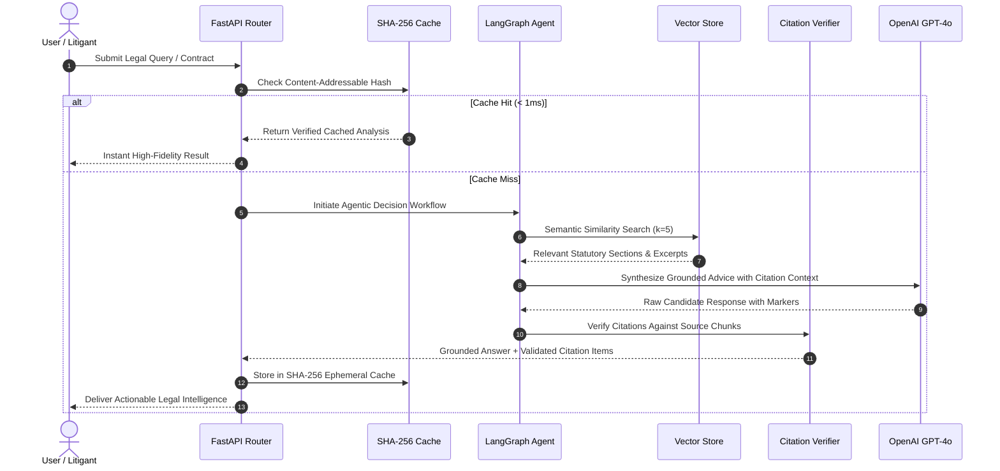

# Juris AI — Architecture & Decision Logic

## 1. System Overview

**Juris AI** is a specialized Generative AI legal intelligence and accessibility platform. It combines agentic retrieval-augmented generation (RAG), statutory reasoning guardrails, and deterministic document parsing to empower self-representing litigants, entrepreneurs, and legal professionals.

---

## 2. High-Level Architecture Diagram

```mermaid
graph TD
    User([User / Client Browser]) -->|HTTPS / WSS| WebUI[React 19 + TypeScript + Vite UI]
    
    subgraph Frontend["Frontend Layer (Port 5173 / Vercel)"]
        WebUI --> Nav[Semantic Navigation Router]
        Nav --> LandingPage[Landing Page & Showcase]
        Nav --> ChatView[Statutory Q&A Engine]
        Nav --> SimplifyView[Document Simplifier & Plain English]
        Nav --> CompareView[Clause Cross-Comparison]
        Nav --> RiskView[Multi-Document Risk Analyzer]
        Nav --> PrepView[Attorney Intake Briefing]
    end

    WebUI -->|REST API Requests| FastAPIServer[FastAPI Backend Engine (Port 8000)]

    subgraph Backend["Backend Layer (FastAPI / Render / Docker)"]
        FastAPIServer --> SecMid[Security Headers & Rate Limiting Middleware]
        SecMid --> Router{API Route Handler}

        Router -->|/api/chat| ChatHandler[Async Chat Handler]
        Router -->|/api/documents/analyze| DocHandler[Document Risk Analyzer]
        Router -->|/api/documents/compare| CompHandler[Clause Comparison Engine]
        Router -->|/api/documents/lawyer-prep| PrepHandler[Attorney Brief Generator]

        DocHandler --> HashCache[(SHA-256 Content-Addressable Cache)]
        CompHandler --> HashCache
        PrepHandler --> HashCache

        ChatHandler --> AgenticGraph[LangGraph Agentic Decision Pipeline]
        AgenticGraph --> VectorRetriever[Semantic Vector Store (ChromaDB)]
        AgenticGraph --> CitationResolver[Citation Resolver & Grounding]
        AgenticGraph --> LLMService[OpenAI GPT-4o / GPT-4o-mini]

        DocHandler --> DocService[Document Ingestion Service (pypdf / python-docx)]
        DocService --> LLMService
    end

    subgraph Storage["Storage & Knowledge Base"]
        VectorRetriever --> Statutes[(Constitution & Indian Legal Code DB)]
        AgenticGraph --> RedisCache[(Redis Session History & TTL Cache)]
    end
```

---

## 3. Decision-Making Logic & Hallucination Guardrails



---

## 4. Persona Workflows & Target Audiences

### Persona A: The Self-Representing Litigant / Consumer
- **Challenge:** Faced with a dense 25-page residential lease or service agreement with threatening indemnity clauses.
- **Workflow:** Uploads agreement to **Document Risk Analyzer** -> receives plain English translation of each clause with high-risk liabilities highlighted -> uses **Attorney Prep Sheet** to arrive at legal aid clinic prepared with exact questions.

### Persona B: The Startup Founder / SMB Operator
- **Challenge:** Receives a heavily redlined vendor agreement from an enterprise client with altered termination and IP assignment clauses.
- **Workflow:** Uploads original and redlined drafts to **Clause Cross-Comparison** -> receives immediate side-by-side diff highlighting shifted risk liabilities and omitted safeguards.

### Persona C: The Legal Tech Researcher / Law Student
- **Challenge:** Needs to research constitutional case law and statutory codes with verifiable references.
- **Workflow:** Queries **Statutory Q&A** -> receives direct citations to articles, acts, and procedural codes with zero hallucinated authorities.
